# What Does this Look Like as a Student?

Let's go over what a student would experience using this system. I'll start with a high-level walk-through of a typical scenario and then provide a "real-life" walk-through

## A High-Level Scenario

For the sake of building a narrative, let's say Student X is ready to get started on an assessment of some kind.

Here's what happens from the student's perspective:

1. They log into Blackboard, go to the list of available drill links, and click on the desired one.
   > **result**: a GitHub repo containing a copy of the starting code for the drill is created by GitHub Classroom and the student is given non-admin access to this repo. Emails are sent to the student and instructor, notifying them that
1. The student clones the repo to their own machine. Perhaps because they're not quite comfortable with Git commands yet, they decide to download a zip file and unzip it into a convenient location.
   > **result**: the student now has a folder containing all the folders and files they need to start working.
1. The student uses the Import Existing Project into Workspace command in Eclipse with the downloaded folder.
   > **result**: Eclipse creates a working Eclipse project, using configuration files located in the starting project to initialize any necessary Eclipse plugins.
1. The student begins coding a solution (after thinking long and carefully about the problem first, naturally).
   > **result**: as the student saves their work, the Infinitest Eclipse plugin gives them immediate feedback about whether the unit tests provided with the project are passing or failing. Also, static code analysis tools like Checkstyle and PMD display any violations after every source file save.
1. The student continues working on the drill, with the aim of making all the tests pass and all the analysis tools happy. Eventually, they get to that point and are ready to submit their work. Because they're still not comfortable with Git commands, they decide to log into GitHub, go to their drill repo page, and drag and drop the src folder from their project in Eclipse into the GitHub page, remembering to commit their work.
   > **result**: after hitting commit, emails are sent to both student and instructor that a commit has happened on the Feedback branch for the assignment.
1. The student now officially submits their work by going to the Actions tab in their repo page, choosing the "Submit" workflow, and running it. As part of this process, they are forced to enter their myMRU username.
   > **result**: after starting the run, a GitHub Workflow (which is part of the starting template) is triggered. This runs a build, which includes compiling the code, running the same static code tools as were used in Eclipse, and running the unit tests in the project. A summary report with a standardized format of the results is generated. This whole process takes about a minute.
   > **result**: after the above process completes, a GitHub App steps in and makes a copy of the results in a submissions directory. An Issue with the summary report results is created in the student's repository and an email is sent to the student.

## A Step-by-step with a real project

Let's do this again; this time, we'll walk through in more detail.

### Before a student begins

A couple of things have to happen before a student can work on and submit something: they need to get a GitHub account and they need to set up Eclipse.

#### GitHub account

This is pretty straightforward - students can sign up for a free account if they don't already have one.

Although it is _nice_ if they have GitHub username that matches their myMRU username, it isn't _necessary_. (Because the submission process requires them to enter their myMRU username, the only annoyance you will find is with the emails that are sent out by GitHub, as those will use the GitHub username.)

In the end, it's your call - if you are going to force the issue, you should remember that you are creating an annoyance for those folks who already have an account....

#### Eclipse setup

- install the desired version of OpenJDK (I suggest going through https://adoptopenjdk.net/)
- install the latest version of Eclipse (Java Developers version) and then add the following plug-ins:
  - **pmd-eclipse-plugin** (source code analyzer; finds common flaws)
  - **eclipse-cs** (Checkstyle - source code analyzer; enforces coding standards)
  - **infinitest** (continuous test runner)
- set useful global Eclipse preferences (`Window > Preferences`): - tell PMD to **not** show the PMD perspective (it's just one more perspective for students to keep track of and it's not needed) and to check for issues after every save
- 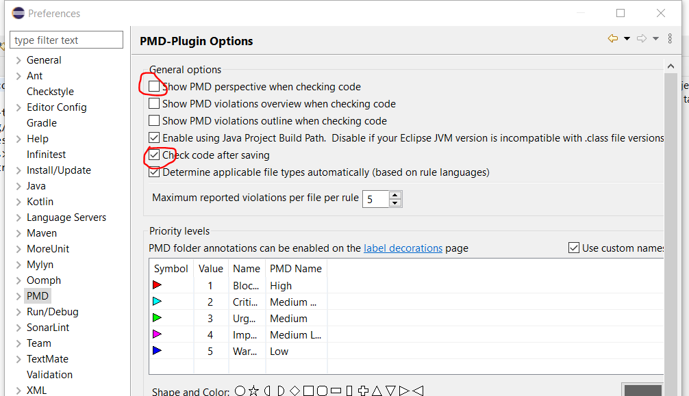
- set

### The Walk-through

1. Go to https://classroom.github.com/a/oVSuSWsm to accept the assignment.

   > **result:** a repo with the starting template is created and you are given non-admin access to that repo. A link to that repo is provided in the web browser after a few moments.
   > 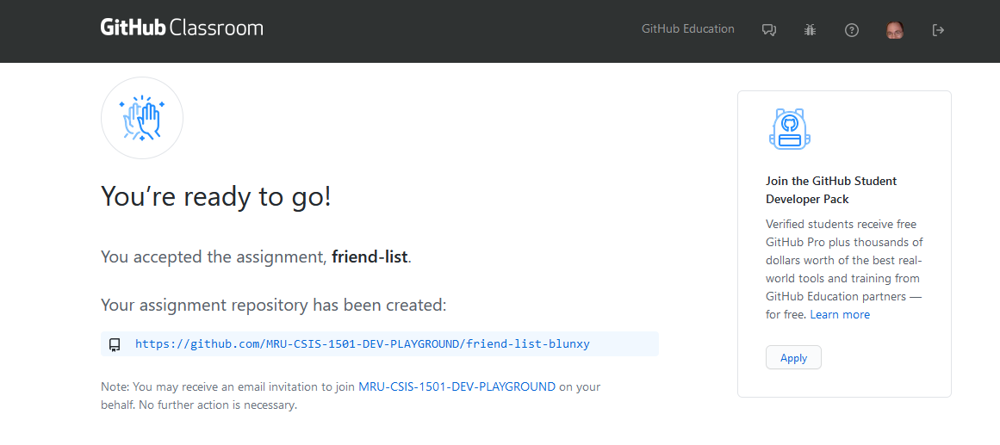

   > **result:** a variety of emails are sent to the student
   > 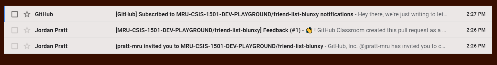
   >
   > - one comes from the owner of the organization which tells them they've been invited to the assignment (they can ignore this one)
   > - another one, also from the organization owner, lets you know that a pull request has been created so that your instructor can leave feedback about your work. [this is an option that you are given when you create a GitHub Assignment - it could be super-confusing to students, so would recommend treading carefully here]
   > - the third one comes from GitHub and lets you know that you've been auto-subscribed to the repo (remember - it's not _your_ repo - it's the organization owner's!), which is nice, since you'll get notified every time something happens to that repo

   > **result:** an email is sent to the instructor, letting them know that the feedback branch has been created

2. Go to the link provided when you accept the Assignment and either grab the assignment via a zip file, or better yet, do a clone. (If you decide for your students to use zips, then they _must_ upload via the repository's web page; it's a trade-off of "easier now vs harder later" IMO).

3. Import the repo into Eclipse via the _File > Import > General > Existing Projects into Workspace_

   > **result:** The project will load and all the analysis tools should become active; in addition, Inifinitest should go yellow, indicating that there are errors that are stopping the unit tests from running:
   > 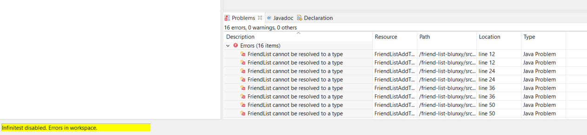

4. We'll add a stubbed-out `FriendList.java` to `src/main` to stop the compilation errors.

   > **result:** The compilation errors are gone, so Infinitest runs and reports failing tests (notice the red bar). Also, the failing tests are showing up under problems - and there is a warning from PMD now as well!
   > 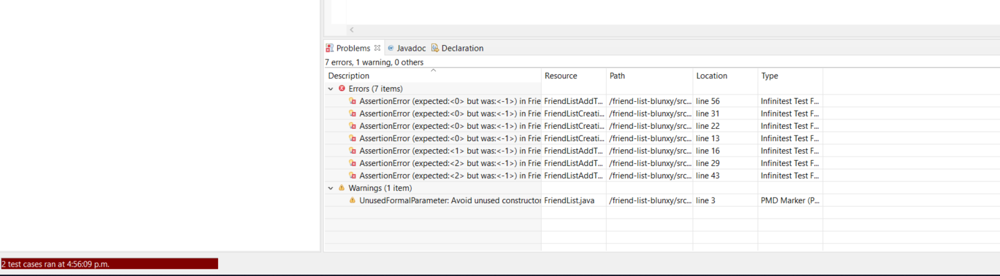

5. Let's assume that the student runs out of time and decides to submit their work at this point. They save their work and now have to commit **and push** their work. They can do this either by dragging and dropping into the GitHub repo webpage, or by committing and pushing via the command line.

   > **result:** An email is sent to the student confirming that a commit has happened; the instructor will get a similar email as well.

   > **result:** The commit message and time stamp change on the repo web page. _Always get your students to confirm this!_ If they're truly paranoid - and why not? - they should click on the submit message and confirm that the changes they made have been actually uploaded!
   > 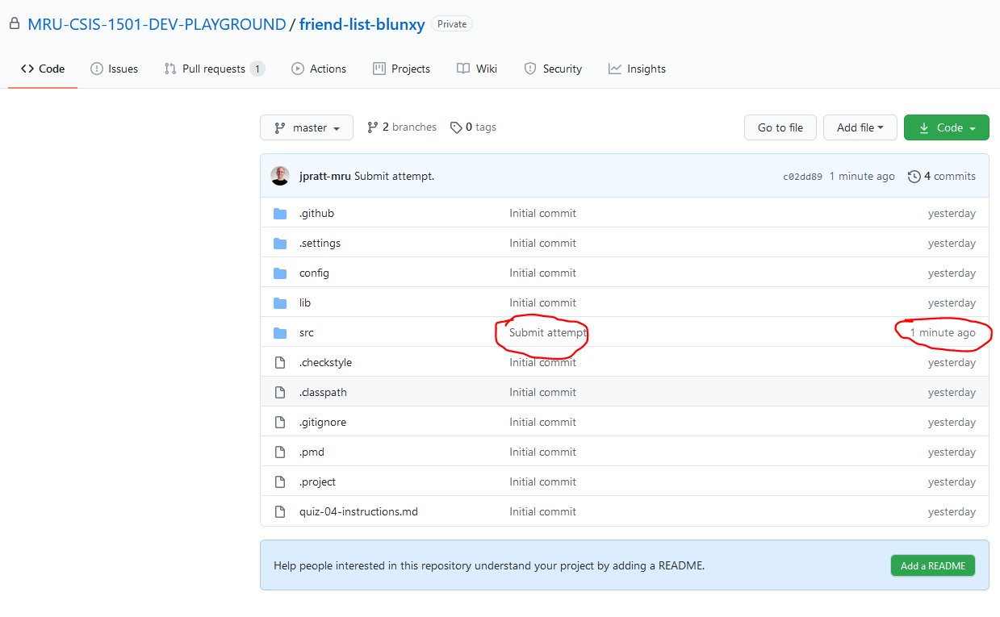

6. Now it's time to start the submit workflow. Go to the Actions tab and click on _Submit this assessment_.

   > **result:** The _Run workflow_ button will become available.
   > 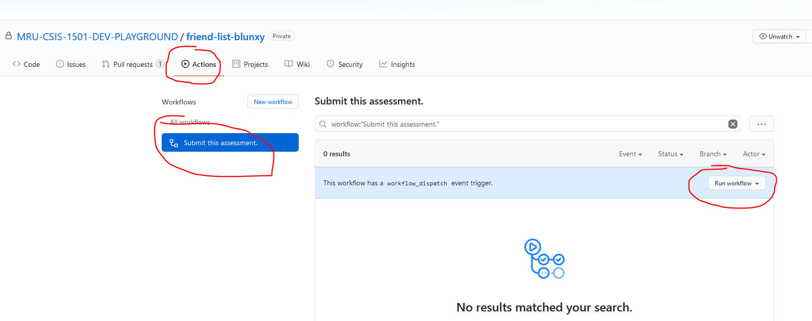

7. Click on the _Run workflow_ button.

   > **result:** The workflow form will appear, prompting for the MRU username to use.
   > 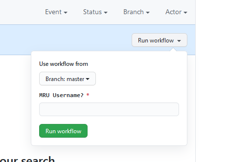

8. Enter in the MRU username in the form that appears and click _Run workflow_.

   > **result:** After a few seconds, we'll see that the workflow has started.
   > 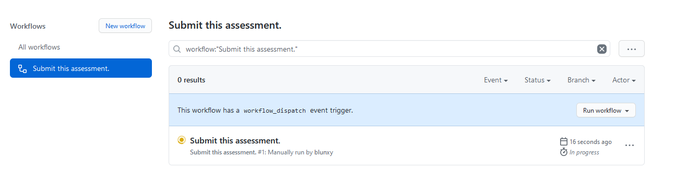

9. Click on the running workflow and then click on the _build_ link on the side.

   > **result:** We'll see the build in action on its virtual machine
   > 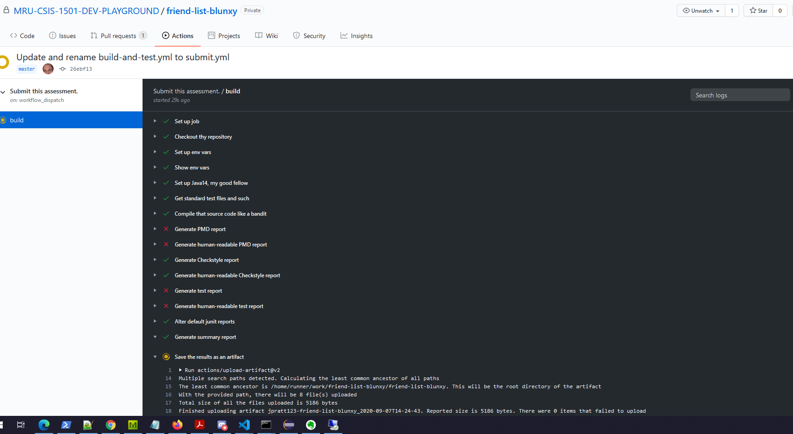

10. Wait (about 1 minute) for the build to complete.

> **result:** We'll get an email, letting us know that an issue has been created containing the summary report for the build. (This is NOT a default thing for workflows BTW - it's actually in the current workflow script!)

> **result:** An issue will appear in the Issues tab containing the summary report of the build.
> 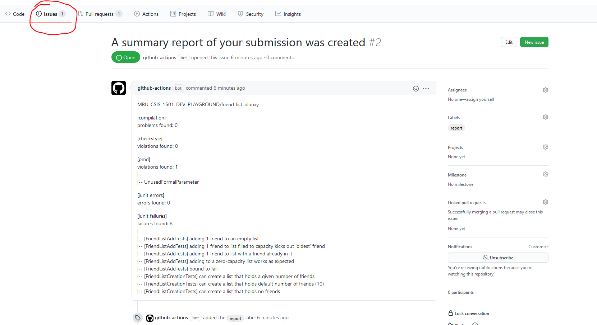

> **result:** We'll get an email, letting us know that an issue has been created containing the summary report for the build. (This is NOT a default thing for workflows BTW - it's actually in the current workflow script!)
> 

> **result:** The organization's submission repo now contains an entry for the submission. It contains both the summary report and a zip containing the summary report and also detailed reports and results of the build.
> 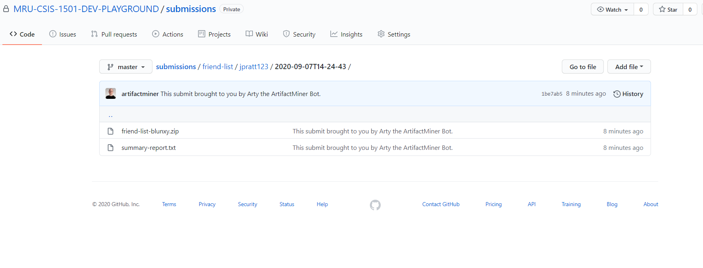
