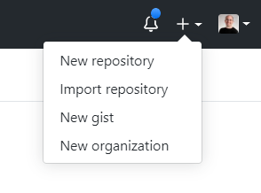
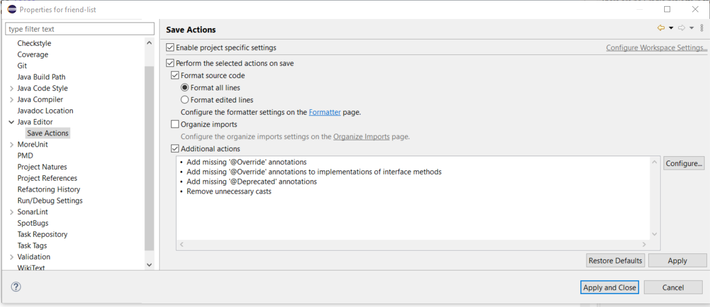
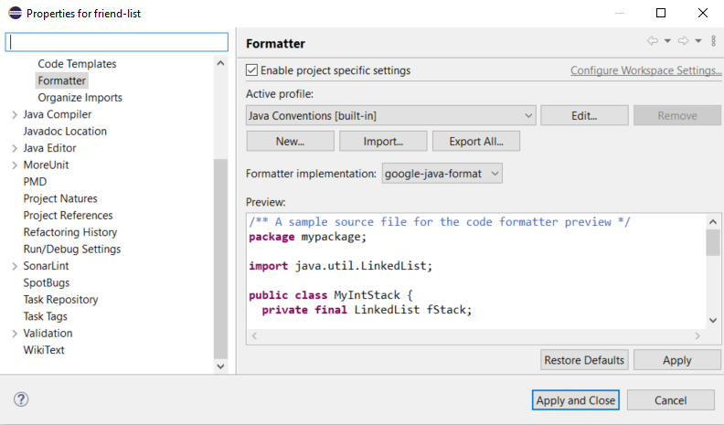

# project: an autograded Eclipse project

Heads-up: this is long. It's gotta be long, because there is a lot to talk about - this is not a "click a button and its done" kind of endeavour....but it's not crippling in its difficulty. I'm not that smart, so it can't be! :)

## the players

To make this work, we're going to be using the following:

- **Eclipse (OS doesn't matter)** - for editing and running automated code analysis tools and tests
- **GitHub** - for storing assessments and documentation
- **GitHub Classroom** - for distributing starter code and assessment submission
- **GitHub Actions** - for compiling, running code analysis tools and tests, and summarizing the results

## getting ready

### GitHub

Assuming you have a GitHub account, you'll want to set up a GitHub Organization for your section each semester; if you're teaching a course with multiple instructors involved and plan to have common assessments, you will likely want to create an _additional_ Organization to hold the shared assessment docs and starter code

- create a free GitHub Organization -  - I've named my Organizations like this: `MRU-CSIS-1501-201904-001` (the `201904` is `[year][term]` and the `001` is the section number). It'd be nice if there was a consistent naming scheme across instructors...but I suspect it'll be hard to enforce this and even trying might not be worth the effort!
- choose **personal account**
- upgrade it, using[these steps](https://classroom.github.com/help/upgrade-your-organization) - the important part here is the [Org upgrade offer link](https://education.github.com/toolbox/offers/github-org-upgrades) - you'll have to wait a few days (3 or 4 work days in my experience) to get approved, so don't leave this to the last minute!
- Here's a [step-by-step of this process](https://www.evernote.com/shard/s23/u/0/sh/b66b520c-ddb7-403e-954c-af06d42d6d63/99f699242239674697ba9ee30e99852a) done by another edu org...it seems pretty thorough

## an example project

For this example, I'm using an actual lab quiz that I used in Fall 2019, modified to use the autograded workflow.

### the completed teacher version

You can clone this project here: https://github.com/MRU-CSIS-1501-DEV-PLAYGROUND/friend-list-teacher-version.git

Here is a full listing of the contents of this repo:

```
│   .checkstyle
│   .classpath
│   .gitignore
│   .pmd
│   .project
│   quiz-04-instructions.md
│
├───.github
│   └───workflows
│           build-and-test.yml
│
├───.settings
│       org.eclipse.jdt.core.prefs
│       org.eclipse.jdt.ui.prefs
│       org.sonarlint.eclipse.core.prefs
│
├───bin
│       FriendList.class
│       FriendListAddTests.class
│       FriendListApp.class
│       FriendListCreationTests.class
│       Main.class
│
├───config
│   ├───checkstyle
│   │       1501-checks.xml
│   │
│   └───pmd
│           comp1501-pmd-rules.xml
│
├───lib
│       assertj-core-3.13.2.jar
│
└───src
    ├───main
    │       FriendList.java
    │       FriendListApp.java
    │       Main.java
    │
    └───test
            FriendListAddTests.java
            FriendListCreationTests.java
```

Let's go through all the bits, file-by-file, folder-by-folder. It won't hurt too much.

#### commentary on the files and folders

Unless noted otherwise, you can assume the following is all shared with students via a starter template.

- `.checkstyle`
  - this is a file created by Eclipse when you set up a local checkstyle configuration for a project (_[right-click project] > Properties > Checkstyle_)
  - it's a simple (and mercifully short) XML file that points to whatever Checkstyle configuration you decide to use for your assessment; this might be a neutered one for a time-pressured assessment like a quiz or final, where you don't want students to spend time focusing on the minutiae of code formatting to a straight-as-an-error hardcore one for an assignment where they have plenty of time
  - the configuration file is located in `config/checkstyle` (see below)
- `.classpath`
  - XML file auto-generated by Eclipse for every project
  - tells Eclipse where to find source directories, where to save compiled files, notes the use of JUnit, and where libraries are stored
  - even though these are technically auto-generated when you create a new project in Eclipse, it is very useful to copy-and-paste the one that is generated in your teacher version into any student template versions you make
  - **of special note:** the `ignore_optional_problems` attribute is set to true for each `classpathentry` element in order to stop **both** Eclipse **and** PMD from reporting the same errors, likely confusing students. This setting can be tweaked through the project's _Build Path > Configure Build Path > Source tab > Ignore optional compile problems_ toggled to **Yes**.
- `.gitignore`
  - at the very least, have `bin` in here...
- `.pmd`
  - same kind of deal as in the `.checkstyle` entry above
- `.project`
  - auto-generated by Eclipse
  - while it has some super-useful things in it (like telling Eclipse to activate Checkstyle and PMD for the project), it's got one big problem: the damn `<name></name>` entry; if you give your `.project` to your students via the starter code, you'll have a helluva time bringing those projects into Eclipse (if you need to), because Eclipse doesn't let you have multiple projects with the same name...and it doesn't necessarily fail with great fanfare, which is hella-confusing
  - **gotcha**: nevertheless, I can say with great certainty this inconvenience is far outweighed by the flaky nature of PMD without the `.project` settings - I've confirmed that even with a proper `.pmd` file, activating PMD for the project via project properties sporadically (hooray!) ignores these settings. So in the end, I think handing out a `.project` file in the starter code is necessary.
- `quiz-04-instructions.md`
  - although this particular example has the instructions as a file in the project, the more I think about it, the more I think it's a better idea to use a `readme.md` (which GitHub shows by default when you land on the repo) that simply has a link to _another_ repo where the instructions are. Here's why: instructions are things that change frequently, right? By putting them in a single place, then you can make changes to them easily without needing to push the changes out to everyone. Also, I think it'll be useful for other instructors (including your future self) if there's a one-stop shop for _all_ assessment instructions.
- `.github`
  - `workflows`
    - `build-and-test.yml`
    - this is the secret sauce file that causes a bunch of stuff - compilation, code analysis, testing, summary report generation - to happen on push via GitHub Actions (https://docs.github.com/en/actions) - a YAML file (it doesn't have to be called `build-and-test.yml`, but it **does** need to be in `.github/workflows` and be a properly-formed workflow file - I'll talk about this file in more detail later
- `.settings`
  - the following are all auto-generated by Eclipse according to project-specific setting made by the instructor; you want to share these so that all students have the same editing experience as the work on assessment
  - `org.eclipse.jdt.core.prefs`
  - `org.eclipse.jdt.ui.prefs`
  - the above 2 are tied into the following settings:
    - the project's _Java Editor > Save Actions_ properties, which I currently have set to this:
      - 
    - the projects _Java Code Style > Formatter_ properties, which I currently have set to this:
      - 
    - these settings together ensure that indentation follows the Google standard and is enforced automatically on each save, making crazy indentation issues a thing of the past. Whew.
  - `org.sonarlint.eclipse.core.prefs`
    - turns off SonarLint (if it's present in the user's Ecipse plug-ins), since it duplicates much of the work of PMD.
    - this is here because SonarLint is currently part of the lab install.
- `bin` **not shared with students**
  - not terribly exciting - just the location for compiled binaries
- `config`
  - `checkstyle`
    - `1501-checks.xml`
    - these are the Checkstyle rules enforced for the project - mostly the same as the standard `google_checks.xml` document that comes in the jars found in https://checkstyle.sourceforge.io/
    - **important** if you're going to tweak the Checkstyle rules - and you **will** want to do so - then make sure you start with the same version of Checkstyle as is used in the Eclipse plug-in! (This has bitten me before and I hated it.) We're currently (as of 2020-08-24) using 8.34 - the file provided here makes two alterations to the standard google checks using `SuppressionSingleFilter` entries:
      - one stops **all** checks on all java files in `src/test`...this is very much a "do as I say, not as I do" situation - I get it. But as instructors, we sometimes play a little fast and loose with the rules and any warnings from _our_ code is just going to confuse students.
      - the other stops Checkstyle from barking for not having JavaDoc blocks before every public method. We usually talk about JavaDoc later in the programming stream, so I left it out here for the 1501 class.
    - `pmd`
      - `comp1501-pmd-rules.xml`
      - these are analogous to the above Checkstyle settings
      - you can use https://pmd.github.io/latest/pmd_rules_java.html as a guide for making rule tweaks...there are a lot of rules, but if you look in this file, you'll see many are commented out.
- `lib`
  - `assertj-core-3.13.2.jar`
  - I'd suggest putting all external jars in a lib directory and then make sure you link to them via _Java Build Path > Libraries tab > Add JARs_
  - **gotchas**
    - you'll have to make the `lib` directory yourself - it's not a standard directory
    - make sure you click on **Classpath** in the above window before clicking on Add JARs
    - if you've just copied a JAR into the lib directory, make sure you refresh the project in the package explorer before you click on Add JARs...if you don't, then the JAR won't show up in the resulting dialogs and you will think you are going INSANE
- `src`
  - `main`
    - `FriendList.java`
    - `FriendListApp.java`
    - `Main.java`
    - this directory structure...`src\main` and `src\test` is just one suggestion
    - remember to mark these directories as source directories in Eclipse via _Java Build Path > Source tab_
    - **important:** if you choose a different structure, or decide to use packages, you will have to modify the Google Action script and the scripts used to manipulate student submissions to handle the new compilation commands (more on that later)
  - `test`
    - `FriendListAddTests.java`
    - `FriendListCreationTests.java`
    - JUnit 5 tests go in here
